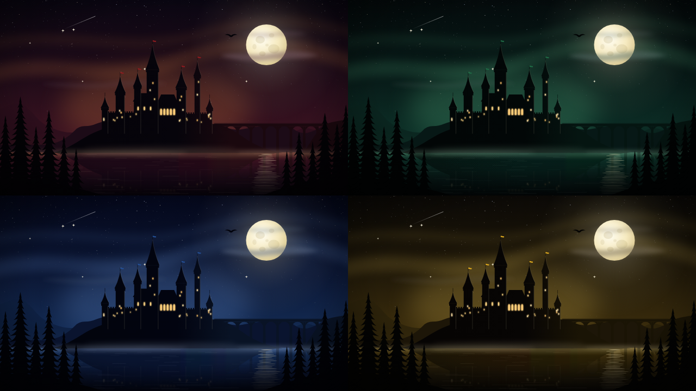

<p align="center"></p>

# LumOS

Une distribution Linux d'**audit de sécurité** à l'ambiance d'école de sorcellerie.
Pensée comme une alternative à Kali Linux, mais bâtie sur **Arch Linux** + le dépôt **BlackArch** (~2800 outils de pentest, forensic et rétro-ingénierie) et le bureau **KDE Plasma**.

Au premier démarrage, le Choixpeau te pose trois questions et t'envoie dans une maison ; le bureau prend alors ses couleurs. Dans le terminal, on installe un outil avec `accio`, on met à jour avec `reparo`, on éteint avec `mefait-accompli`.



> Projet de fan, non officiel, sans but commercial et sans lien avec Warner Bros. ni J.K. Rowling. Aucun logo, police ou illustration officiels : tous les dessins sont originaux.

## ⚡ Cadre d'emploi

LumOS rassemble des outils de test d'intrusion. Ils sont destinés à des usages **légaux** : audit de tes propres systèmes, missions avec **autorisation écrite** du propriétaire, formation, CTF, forensic. Les employer contre des systèmes tiers sans accord est illégal (en France, articles 323-1 et suivants du Code pénal) et contraire à l'esprit du projet. Tu es seul responsable de ce que tu lances.

## Ce qu'il y a dedans

- **Une ISO live** : bureau Plasma en français, compte `sorcier` sans mot de passe, dépôt BlackArch déjà configuré, outils d'installation d'Arch (`archinstall`).
- **Une trousse de sécurité** (voir [`iso/packages.security`](iso/packages.security)) : nmap, wireshark, metasploit, aircrack-ng, john, hashcat, hydra, sqlmap, ffuf, radare2, binwalk, volatility3… Le reste de BlackArch s'installe à la demande avec `accio`.
- **Quatre maisons** (Gryffondor, Serpentard, Serdaigle, Poufsouffle) : chacune a son jeu de couleurs, son fond d'écran et sa couleur d'invite. Le thème clair « Parchemin » s'allume avec `lumos`.
- **Le Choixpeau** : `choixpeau` relance la cérémonie, `choixpeau --choisir` laisse choisir, `maison serdaigle` change directement.
- **Le grimoire** : les commandes du quotidien sous forme d'incantations.

| Sortilège | Effet |
| --- | --- |
| `accio <paquet>` | installe un paquet (dépôts Arch + BlackArch) |
| `evanesco <paquet>` | désinstalle un paquet |
| `reparo` | met tout le système à jour |
| `revelio <mot>` | cherche un paquet |
| `alohomora <commande>` | exécute en administrateur |
| `lumos` / `nox` | thème clair / thème sombre de la maison |
| `geminio <source> <copie>` | duplique |
| `wingardium-leviosa <source> <destination>` | déplace |
| `reducto <dossier>` / `engorgio <archive>` | compresse / décompresse |
| `stupefix` / `enervatum <processus>` | fige / réveille un processus |
| `finite-incantatem <processus>` | arrête un processus proprement |
| `avada-kedavra <processus>` | tue un processus |
| `hominum-revelio` | montre qui est connecté |
| `portus [dossier]` | change de dossier |
| `obliviate` | efface l'écran et l'historique |
| `mefait-accompli` | éteint l'ordinateur |
| `grimoire` | affiche la liste |

## Obtenir l'ISO

**Avec GitHub** (rien à installer) : onglet *Actions* › *ISO* › *Run workflow*. L'ISO est téléchargeable dans les artefacts de l'exécution. Pousser une étiquette `v0.1` construit l'ISO et la joint à la version.

**Sur une machine Arch Linux** :

```bash
sudo pacman -S --needed archiso librsvg ttf-liberation curl
sudo ./build.sh
```

L'ISO arrive dans `out/`. `build.sh` installe le trousseau de clés BlackArch sur la machine de construction et ajoute le dépôt au système (pour que `pacstrap` puisse vérifier les paquets signés). Pour l'essayer : VirtualBox ou VMware (4 Go de mémoire), ou une clé USB (Ventoy, Rufus, `dd`).

## Installer LumOS sur un disque

En mode live, rien n'est sauvegardé (tout tourne en mémoire). Pour un système permanent, l'installateur **`lumos-installer`** (icône « Installer LumOS » sur le bureau, ou `sudo lumos-installer` en console) **clone le système live sur le disque** : tout le thème — maisons, Choixpeau, outils, menu — est donc conservé. Il règle ensuite l'amorçage (GRUB, UEFI ou BIOS), crée un utilisateur et retire ce qui est propre au live. L'installateur **efface le disque choisi** : à réserver à une machine ou une VM de test. Une fois installé, le Choixpeau ne te répartit **qu'une seule fois** et ta maison est gardée.

## Mettre le thème sur un Arch déjà installé

Sur un Arch Linux avec KDE Plasma, sans passer par l'ISO (applique le thème, pas les outils de sécurité) :

```bash
sudo ./install.sh
```

Le Choixpeau se présente à la prochaine ouverture de session. `sudo ./install.sh --desinstaller` retire tout.

## Organisation du dépôt

| Dossier | Rôle |
| --- | --- |
| `themes/maisons.conf` | la palette : source unique des couleurs et des fonds d'écran |
| `rootfs/` | les fichiers du thème, posés tels quels dans le système (ISO et `install.sh`) |
| `iso/` | ce qui ne concerne que l'ISO : paquets ajoutés/retirés, outils de sécurité, session live |
| `assets/` | logo, écran de démarrage, fonds d'écran (SVG) |
| `tools/` | fonctions communes et générateur des fonds d'écran |
| `build.sh` | construit l'ISO à partir du profil officiel `releng` d'archiso |
| `install.sh` | applique le thème à un système existant |

Changer une couleur : modifier `themes/maisons.conf`, puis `python tools/dessiner_fonds.py`. Ajouter un outil par défaut : une ligne dans `iso/packages.security`. Ajouter un sortilège : une ligne dans le tableau et un cas dans `rootfs/usr/local/bin/sortilege`.

## État et suite

Version de départ : l'ISO n'a pas encore été construite ni démarrée ; la première construction dira ce qu'il reste à ajuster (surtout la liste BlackArch et la taille de l'ISO).

À venir : écran de connexion (SDDM) et animation de démarrage aux couleurs des maisons, sons, jeu d'icônes, dépôt de paquets. Faits : installateur sur disque (`lumos-installer`) et menu des outils rangé par matière.

## Licence

Code et illustrations sous licence MIT (voir `LICENSE`). Arch Linux, BlackArch et KDE sont des marques de leurs détenteurs respectifs ; les noms tirés de l'univers de Harry Potter appartiennent à leurs ayants droit.
